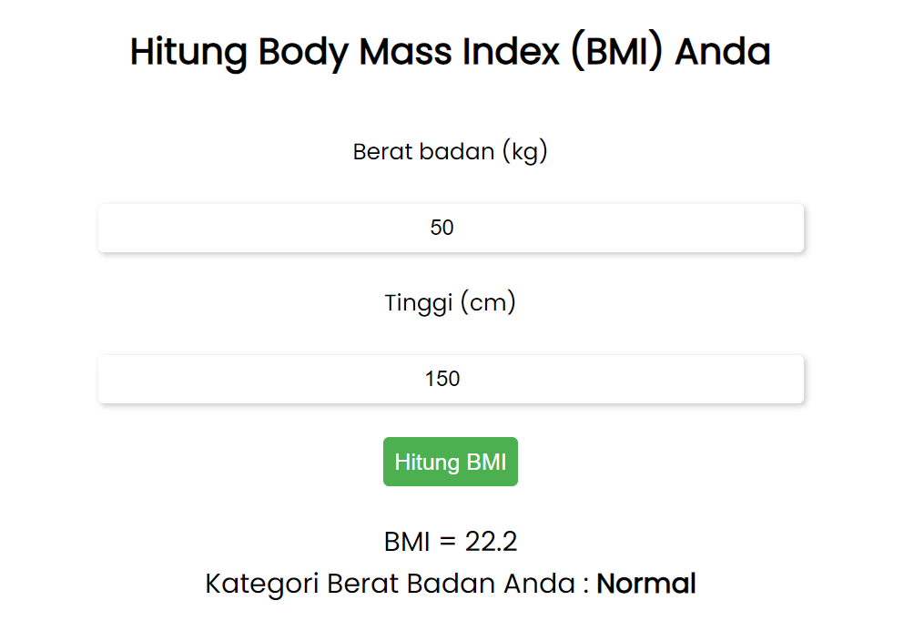

# _Program Kalkulasi BMI_

## Keterangan Tugas

Nama &nbsp;&nbsp;&nbsp;&nbsp;&nbsp;&nbsp;&nbsp;&nbsp;&nbsp;&nbsp;: Monika Angelia Panjaitan <br>
Kelompok &nbsp;&nbsp;&nbsp;&nbsp;: BE 10 <br>
Mentor &nbsp;&nbsp;&nbsp;&nbsp;&nbsp;&nbsp;&nbsp;&nbsp;: Amilin <br>
Tugas &nbsp;&nbsp;&nbsp;&nbsp;&nbsp;&nbsp;&nbsp;&nbsp;&nbsp;&nbsp;: Technical Project Assignment (TPA) #2 - BMI Calculator

---

<br>

_form di index.html_

```html
<form>
  <label for="weight">Berat badan (kg)</label>
  <input type="number" id="weight" class="input" placeholder="Masukkan Berat Badan" required />
  <div id="weight-error" class="error"></div>
  <label for="height">Tinggi (cm)</label>
  <input type="number" id="height" class="input" placeholder="Masukkan Tinggi Badan" required />
  <div id="height-error" class="error"></div>
  <button type="button" onclick="calculateBMI()">Hitung BMI</button>
</form>
<div class="result" id="result"></div>
```

<br>

_fungsi **calculateBMI()** di script.js_

```javascript
function calculateBMI() {
  // mendapatkan nilai inputan user
  const weightInput = document.getElementById("weight");
  const heightInput = document.getElementById("height");
  const weight = parseFloat(weightInput.value);
  const height = parseFloat(heightInput.value) / 100; // konversi ke meter

  // validasi inputan user
  let hasErrors = false;
  if (isNaN(weight) || weight <= 0) {
    document.getElementById("weight-error").innerHTML = "Berat Badan harus merupakan bilangan positif diatas 0 dan tidak boleh kosong";
    hasErrors = true;
  } else {
    document.getElementById("weight-error").innerHTML = "";
  }
  if (isNaN(height) || height <= 0) {
    document.getElementById("height-error").innerHTML = "Tinggi Badan harus merupakan bilangan positif diatas 0 dan tidak boleh kosong";
    hasErrors = true;
  } else {
    document.getElementById("height-error").innerHTML = "";
  }
  // menghitung BMI jika inputan user valid
  if (!hasErrors) {
    // Hitung BMI
    const bmi = weight / height ** 2;

    // Tampilkan hasil
    let result = document.getElementById("result");
    if (bmi < 18.5) {
      result.innerHTML = `BMI = ${bmi.toFixed(1)} <br> Kategori Berat Badan Anda : <b>Underweight</b>`;
    } else if (bmi < 25) {
      result.innerHTML = `BMI = ${bmi.toFixed(1)} <br> Kategori Berat Badan Anda : <b>Normal</b>`;
    } else if (bmi < 30) {
      result.innerHTML = `BMI = ${bmi.toFixed(1)} <br> Kategori Berat Badan Anda : <b>Overweight</b>`;
    } else {
      result.innerHTML = `BMI = ${bmi.toFixed(1)} <br> Kategori Berat Badan Anda : <b>Obesity</b>`;
    }
  }
}
```

<br><br>

# <b>Preview Aplikasi : </b>


